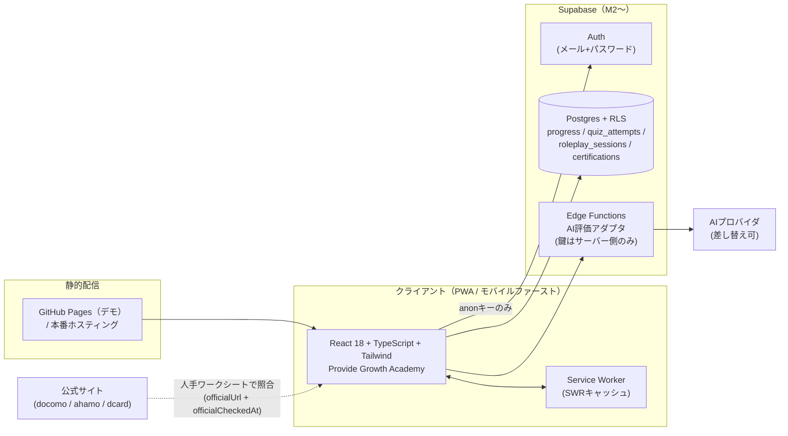
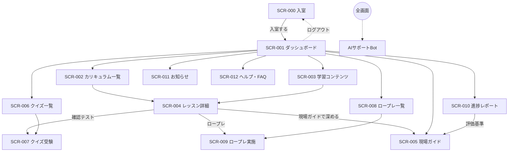
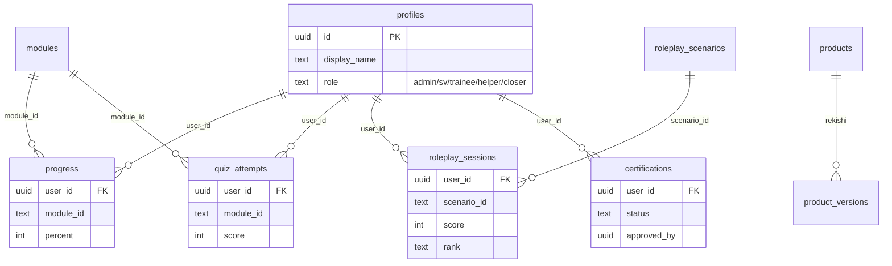

# 基本設計書 — Provide Growth Academy

| 項目     | 内容                  |
| -------- | --------------------- |
| 文書番号 | PGA-BD-001            |
| 版数     | 1.0                   |
| 作成日   | 2026-07-09            |
| 上位文書 | 要件定義書 PGA-RD-001 |

---

## 1. システム構成

### 1.1 全体構成図

### 1.2 技術スタック

| 層           | 技術                                                                              | 備考                                           |
| ------------ | --------------------------------------------------------------------------------- | ---------------------------------------------- |
| UI           | React 18 / TypeScript 5 / Vite 5 / Tailwind CSS 3 / React Router 6 / lucide-react | any禁止・トークン準拠                          |
| 状態         | React Context（ProvideContext）＋ localStorage                                    | M2でSupabaseリポジトリに置換（契約は現行の型） |
| データ       | TypeScriptデータモジュール（seed/curriculum/quiz ほか）                           | 変動数値は商材マスターに集約                   |
| バックエンド | Supabase（Auth / Postgres / RLS / Edge Functions）                                | M2〜。migrationは追加のみ                      |
| テスト       | Vitest + Testing Library（jsdom）／ Playwright（mobile+desktop）                  | CI＝GitHub Actions                             |
| 配信         | GitHub Pages（`PAGES_BASE`サブパス対応）＋ Service Worker                         | SPAフォールバック404対応                       |

## 2. 画面設計

### 2.1 画面一覧

| #   | 画面ID  | 画面名           | ルート                  | 主要機能                                                                                             |
| --- | ------- | ---------------- | ----------------------- | ---------------------------------------------------------------------------------------------------- |
| 0   | SCR-000 | 入室             | （ゲート）              | 名前任意入力・入室。役割選択なし                                                                     |
| 1   | SCR-001 | ダッシュボード   | `/`                     | STEPナビ・現在のカリキュラム・学習ステップ・ゴール・実績・スケジュール・サポート・おすすめ・成功事例 |
| 2   | SCR-002 | カリキュラム一覧 | `/curriculum`           | 5ステップ×19レッスン・ロック・章末まとめ                                                             |
| 3   | SCR-003 | 学習コンテンツ   | `/content`              | レッスンカード一覧・ステップ絞り込み                                                                 |
| 4   | SCR-004 | レッスン詳細     | `/content/:lessonId`    | 教材8要素＋商材ナレッジ＋テスト/ロープレ/ガイド導線＋完了                                            |
| 5   | SCR-005 | 現場ガイド       | `/field-guide?tab=`     | 5タブ（プロセス/場面/ヒアリング/反論/評価・育成）                                                    |
| 6   | SCR-006 | クイズ一覧       | `/quiz`                 | 10モジュール・ベストスコア・合格状態                                                                 |
| 7   | SCR-007 | クイズ受験       | `/quiz/:moduleId`       | 出題・採点・解説・再挑戦                                                                             |
| 8   | SCR-008 | ロープレ一覧     | `/roleplay`             | 12シナリオ・難易度・履歴                                                                             |
| 9   | SCR-009 | ロープレ実施     | `/roleplay/:scenarioId` | 会話・終了評価（12観点）                                                                             |
| 10  | SCR-010 | 進捗レポート     | `/reports`              | 全体進捗・ステップ別・テスト結果・ロープレ評価・ルーブリック導線                                     |
| 11  | SCR-011 | お知らせ         | `/announcements`        | 運営告知                                                                                             |
| 12  | SCR-012 | ヘルプ・FAQ      | `/help`                 | FAQ・用語集28語・Bot導線                                                                             |
| 13  | SCR-013 | SVダッシュボード | `/sv`（M3）             | 研修生別進捗・弱点・認定判定                                                                         |
| —   | CMP-BOT | AIサポートBot    | 全画面スライドオーバー  | 教材ベースのローカル応答                                                                             |

### 2.2 画面遷移図

### 2.3 レイアウト方針

- **デスクトップ（lg≧1024px）**：左サイドバー（濃紺 #16305a グラデ）＋ヘッダー＋コンテンツ（max-w 1320px）
- **モバイル**：ヘッダー＋コンテンツ＋固定ボトムナビ5枠（短縮ラベル）＋BotFAB。STEPナビは2列グリッド
- **情報階層（レッスン詳細）**：白カード＝主役（本文・導線）／フラットtinted＝補助（前提・チャネル差）／オレンジ枠＝コンプラ最重要

## 3. デザイン設計

### 3.1 デザイントークン（Provide基調・固定）

| 要素       | 値                                                                                                                        |
| ---------- | ------------------------------------------------------------------------------------------------------------------------- |
| 基調色     | ネイビー `#16305a→#0a1830`（サイドバー/入室）、白カード、`slate` 系テキスト                                               |
| アクセント | `blue-500/600`（主動線）、`teal`（ヒアリング/補助）、`emerald`（合格/完了）、`orange`（注意/コンプラ）※面で塗らず点で使う |
| フォント   | 見出し・数字＝Poppins（`font-display` / `tabular-nums`）、本文＝Noto Sans JP                                              |
| 形状       | `rounded-2xl` 基調、`shadow-card`/`shadow-lift`、lucide線画 `strokeWidth 2`                                               |
| 状態色     | 完了=emerald / 学習中=blue / ロック=slate / 要確認・警告=orange                                                           |

### 3.2 UI原則（Excellence Rubric）

1. 4状態（loading/empty/error/success）を必ず設計する（静的データは空ガード＋設計判断を記録）
2. 進捗%の重複表示をしない（1画面1回）。数値は `tabular-nums`、数値と単位はスタイル分離
3. コントラストAA（機能情報はslate-500以上）。タップ44px・フォーカスリング必須
4. モーション150–250ms・reduced-motionで無効化

## 4. データ設計

### 4.1 フロントデータモジュール（git管理・教材の正典）

| モジュール                        | 内容                                                                       | 件数              |
| --------------------------------- | -------------------------------------------------------------------------- | ----------------- |
| `src/growth/data/curriculum.ts`   | 5ステップ・19レッスン（8要素）・NAV・FAQ・用語集・QUIZ_MODULES ほか        | —                 |
| `src/data/seed.ts`                | 商材マスター14・トークスクリプト・反論・シナリオ12・EVAL_ITEMS12・認定条件 | —                 |
| `src/data/quiz.ts`                | 確認テスト設問                                                             | 62問/10モジュール |
| `src/growth/data/salesProcess.ts` | 標準販売プロセス                                                           | 15工程            |
| `src/growth/data/scenes.ts`       | 場面別トーク                                                               | 16場面            |
| `src/growth/data/hearingItems.ts` | ヒアリング項目                                                             | 19項目            |
| `src/growth/data/objections.ts`   | 反論処理（新人/上級解説付き）                                              | 17件              |
| `src/growth/data/rubric.ts`       | 評価12観点・育成10段階                                                     | —                 |

### 4.2 DB（Supabase・M2〜）

既存migration（`supabase/migrations/0001_schema.sql`/`0002_rls.sql`）を正とする。主要テーブル：

RLS方針：学習データは本人＋`is_sv_or_admin()`のみ。書込はサーバー側検証を通す。

### 4.3 商材鮮度管理

- `officialUrl` / `officialCheckedAt` / `freshnessStatus(verified|needs_review)` / `isCampaign` / `prohibitedClaims` / `complianceNotes`
- 判定：`freshnessOf()`（明示指定＞90日閾値）。UIは要確認バッジ＋公式リンクをオレンジ表示

## 5. 外部インタフェース

| IF   | 相手             | 方式                        | 備考                                         |
| ---- | ---------------- | --------------------------- | -------------------------------------------- |
| IF-1 | Supabase Auth/DB | supabase-js（anonキー）     | env未設定時はデモモードで全機能動作          |
| IF-2 | AIプロバイダ     | Edge Function経由のアダプタ | 鍵はサーバー側。ローカル応答へフォールバック |
| IF-3 | 公式サイト       | 人手ワークシート照合        | 自動照合不可（403）。PGA-OPS-001 §4          |

## 6. セキュリティ・コンプライアンス設計

1. フロントに秘密情報を置かない（anonキーのみ）。AI鍵・service_roleはEdge Function内
2. RLSで学習データを本人/権限者に限定。audit_logsはサーバー側で書込
3. 教材・UI・テストの三層で断定表現を禁止（prohibitedClaimsをUI表示し、テストでNG選択肢化）
4. パスワード・認証コード本人入力の原則を、教材・ロープレUI・テストに埋め込み済み

## 7. 方式上の決定事項（抜粋）

| #   | 決定                                                              | 理由                                                     |
| --- | ----------------------------------------------------------------- | -------------------------------------------------------- |
| D1  | growth配下はTailwind既定パレット＋strokeWidth2のProvide系統で統一 | 参照デザイン忠実再現をPOが基準承認。全コンポーネント一貫 |
| D2  | 入室は役割選択なしの簡易ゲート（localStorage）                    | PO要件。M2で本認証に接続（画面はそのまま流用）           |
| D3  | 教材本文に変動数値を直書きしない                                  | 鮮度管理を商材マスターに一元化                           |
| D4  | 状態管理はContext＋純粋関数セレクタ                               | Supabase置換時の差し替え面を最小化                       |

詳細は `docs/DECISIONS.md` を参照。
