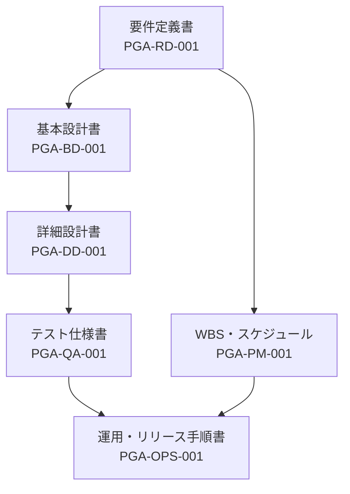

# ドキュメント索引 — Provide Growth Academy

最終更新：2026-07-09 ／ 管理：Claude（デリバリーリード）・高橋（PO）

## 正式ドキュメント体系

| 文書番号    | 文書                                    | パス                                             | 主な読者     |
| ----------- | --------------------------------------- | ------------------------------------------------ | ------------ |
| PGA-RD-001  | 要件定義書                              | [REQUIREMENTS_SPEC.md](./REQUIREMENTS_SPEC.md)   | PO・全員     |
| PGA-BD-001  | 基本設計書（構成/画面/データ/デザイン） | [BASIC_DESIGN.md](./BASIC_DESIGN.md)             | 開発・PO     |
| PGA-DD-001  | 詳細設計書（型/ロジック/画面詳細/規約） | [DETAILED_DESIGN.md](./DETAILED_DESIGN.md)       | 開発         |
| PGA-PM-001  | WBS・スケジュール（完了まで）           | [WBS_SCHEDULE.md](./WBS_SCHEDULE.md)             | PO・開発     |
| PGA-QA-001  | テスト仕様書（単体/結合/E2E/受入）      | [TEST_SPEC.md](./TEST_SPEC.md)                   | 開発・PO     |
| PGA-OPS-001 | 運用・リリース手順書                    | [OPERATIONS_RELEASE.md](./OPERATIONS_RELEASE.md) | PO・運用・SV |

## 運用中の管理台帳

| 文書                                                                     | 用途                                     |
| ------------------------------------------------------------------------ | ---------------------------------------- |
| [ROADMAP.md](./ROADMAP.md)                                               | フェーズ状態・ボード議事                 |
| [DECISIONS.md](./DECISIONS.md)                                           | 設計判断の記録（ADR）                    |
| [AUDIT.md](./AUDIT.md)                                                   | 要確認・負債・監査記録（🔴/🟡/🟢）       |
| [PRODUCT_VERIFICATION_CHECKLIST.md](./PRODUCT_VERIFICATION_CHECKLIST.md) | 商材公式数値の検証ワークシート（PO記入） |

## 参考（経緯・設計資産）

| 文書                                                                                                | 内容                                             |
| --------------------------------------------------------------------------------------------------- | ------------------------------------------------ |
| [CURRICULUM_V2_DESIGN.md](./CURRICULUM_V2_DESIGN.md)                                                | カリキュラム高度化（V2）の設計方針・フェーズ記録 |
| [IMPLEMENTATION_REPORT_V2.md](./IMPLEMENTATION_REPORT_V2.md)                                        | V2実装完了報告                                   |
| [HANDOFF_CURRICULUM_BRUSHUP.md](./HANDOFF_CURRICULUM_BRUSHUP.md)                                    | 外部AI連携用の教材引き継ぎ書                     |
| [DATA_INTEGRITY.md](./DATA_INTEGRITY.md)                                                            | 事実値の取り扱い規律                             |
| [CLAUDE_CODE_BRIEF.md](./CLAUDE_CODE_BRIEF.md) / [DEV_TEAM_AND_SKILLS.md](./DEV_TEAM_AND_SKILLS.md) | 開発ブリーフ・チーム/スキル仕様                  |
| [screens.md](./screens.md)                                                                          | 画面メモ（旧）                                   |

## 改版ルール

- 正式ドキュメント（PGA-\*）の変更は版数を上げ、冒頭表に日付を記録する
- スコープ・完了条件・正典値の変更は **PO承認必須**、判断は DECISIONS.md に残す
