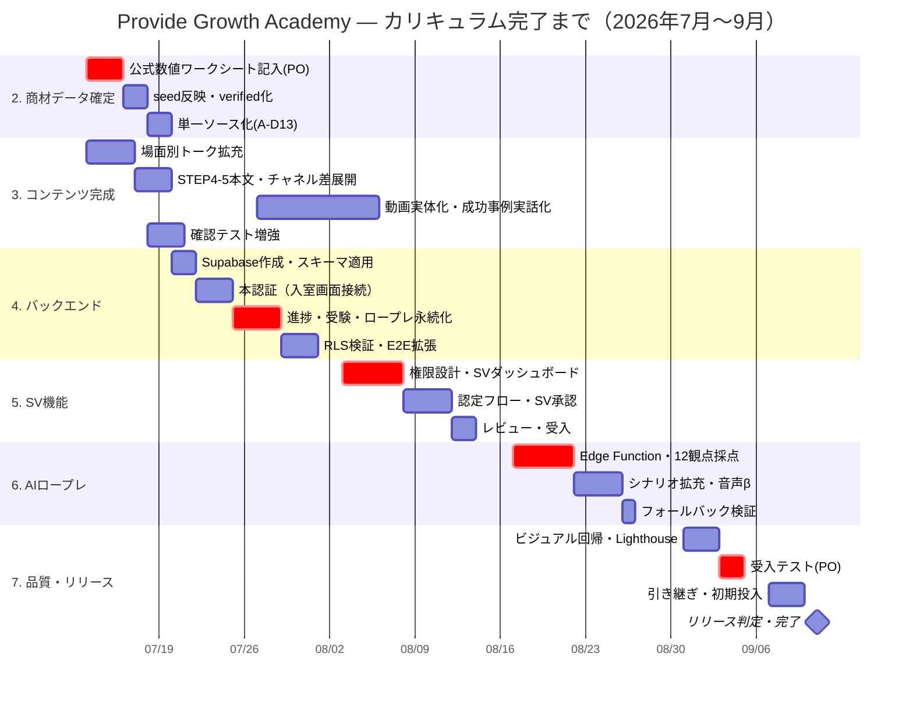

# WBS・スケジュール — Provide Growth Academy カリキュラム完了まで

| 項目     | 内容                                                                     |
| -------- | ------------------------------------------------------------------------ |
| 文書番号 | PGA-PM-001                                                               |
| 版数     | 1.0                                                                      |
| 作成日   | 2026-07-09                                                               |
| 作成     | Claude（デリバリーリード）                                               |
| 承認     | 高橋（プロダクトオーナー）                                               |
| 目的     | カリキュラム完了（現場運用開始可能な状態）までの作業分解と日程を確定する |

---

## 1. ゴール定義（カリキュラム完了の条件）

以下をすべて満たした時点で「カリキュラム完了」とする。

1. **教材の完全版**：全19レッスン・現場ガイド・確認テスト61問以上が、公式確定値で `verified` 化されている
2. **進捗の永続化**：学習者の進捗・受験・ロープレ結果が Supabase に保存され、端末をまたいで継続できる
3. **SV運用**：SVが研修生の進捗・弱点・認定可否を実データで判断できる
4. **AIロープレ**：Edge Function 経由のAI評価が rubric 12観点で採点し、鍵はサーバー側に隔離されている
5. **品質**：typecheck/lint 0・単体/E2E 全緑・Lighthouse 90+・DoD/コンプラ充足でリリース判定合格

## 2. マイルストーン

| ID       | 日付           | マイルストーン                     | 判定基準                                         |
| -------- | -------------- | ---------------------------------- | ------------------------------------------------ |
| M0       | 2026-07-09     | **V2教材・デモ完成（達成済）**     | 全画面走査・E2E 12/12・総合評価98点              |
| M1       | 2026-07-17     | 商材データ確定                     | needs_review 10商材が verified、教材へ反映済     |
| M2       | 2026-07-31     | バックエンド接続                   | 本認証＋進捗/受験/ロープレのDB永続化がE2E緑      |
| M3       | 2026-08-14     | SV機能リリース                     | SVダッシュボード・認定フローが実データで動作     |
| M4       | 2026-08-28     | AIロープレ強化                     | Edge Function採点（12観点）・音声入出力β         |
| M5       | 2026-09-04     | リリース判定                       | 品質ゲート全通過・Lighthouse 90+・受入テスト合格 |
| **完了** | **2026-09-11** | **カリキュラム完了・現場運用開始** | 初期ユーザー投入・運用手順書に沿った引き継ぎ完了 |

## 3. WBS（作業分解構成）

凡例 — 担当：PO=高橋 / CL=Claude（実装・文書）／ 規模：S=0.5日以内・M=1〜2日・L=3〜5日

### 1. プロジェクト管理（全期間）

| WBS | 作業                                          | 担当 | 規模 | 成果物       |
| --- | --------------------------------------------- | ---- | ---- | ------------ |
| 1.1 | 週次進捗レビュー・ROADMAP/DECISIONS/AUDIT更新 | CL   | S/週 | 更新済みdocs |
| 1.2 | マイルストーン判定（M1〜M5）                  | PO   | S/回 | 判定記録     |
| 1.3 | リスク管理（§6）・課題管理                    | CL   | S/週 | AUDIT.md     |

### 2. 商材データ確定（M1・7/13週）

| WBS | 作業                                        | 担当   | 規模 | 依存                              |
| --- | ------------------------------------------- | ------ | ---- | --------------------------------- |
| 2.1 | 公式数値ワークシート記入（10商材）          | **PO** | M    | PRODUCT_VERIFICATION_CHECKLIST.md |
| 2.2 | seed反映・officialCheckedAt更新・verified化 | CL     | M    | 2.1                               |
| 2.3 | 関連レッスン本文・クイズ解説の追従          | CL     | S    | 2.2                               |
| 2.4 | data-integrity監査・AUDIT記録               | CL     | S    | 2.3                               |
| 2.5 | quiz/seed事実値の単一ソース化（A-D13解消）  | CL     | M    | 2.2                               |

### 3. コンテンツ完成（M1〜M3並行）

| WBS | 作業                                                | 担当  | 規模 | 依存     |
| --- | --------------------------------------------------- | ----- | ---- | -------- |
| 3.1 | 場面別トークの往復拡充（15場面×5往復以上）          | CL    | M    | -        |
| 3.2 | STEP4-5本文の4〜5段落化・チャネル差の全レッスン展開 | CL    | M    | -        |
| 3.3 | おすすめ動画の実体化（素材受領→差し替え）           | PO/CL | L    | 素材提供 |
| 3.4 | 成功事例の実話化（現場ヒアリング→執筆）             | PO/CL | M    | 取材     |
| 3.5 | 確認テスト増強（各モジュール6問以上・80問規模）     | CL    | M    | 2.2      |

### 4. バックエンド接続（M2・7/20週〜7/27週）

| WBS | 作業                                                     | 担当  | 規模 | 依存       |
| --- | -------------------------------------------------------- | ----- | ---- | ---------- |
| 4.1 | Supabaseプロジェクト作成・env設定                        | PO/CL | S    | アカウント |
| 4.2 | スキーマ適用（0001/0002 migration・seed投入）            | CL    | M    | 4.1        |
| 4.3 | 本認証（メール＋パスワード、入室画面を接続）             | CL    | M    | 4.2        |
| 4.4 | 進捗・受験・ロープレ結果のDB永続化（ProvideContext置換） | CL    | L    | 4.3        |
| 4.5 | RLS検証（本人/権限者限定）・security監査                 | CL    | M    | 4.4        |
| 4.6 | E2E拡張（認証込みの主要フロー）                          | CL    | M    | 4.4        |

### 5. SV機能（M3・8/3週〜8/10週）

| WBS | 作業                                                   | 担当  | 規模 | 依存 |
| --- | ------------------------------------------------------ | ----- | ---- | ---- |
| 5.1 | SVロール・権限設計（auth_role/is_sv_or_admin）         | CL    | M    | 4.5  |
| 5.2 | SVダッシュボード（完了率・合格率・弱点・ロープレ平均） | CL    | L    | 5.1  |
| 5.3 | 認定フロー（CERT_CONDITIONS自動判定＋SV承認）          | CL    | L    | 5.2  |
| 5.4 | SVコメント・差し戻し                                   | CL    | M    | 5.3  |
| 5.5 | design/code/securityレビュー・受入                     | CL/PO | M    | 5.4  |

### 6. AIロープレ強化（M4・8/17週〜8/24週）

| WBS | 作業                                                   | 担当 | 規模 | 依存 |
| --- | ------------------------------------------------------ | ---- | ---- | ---- |
| 6.1 | Edge Function実装（アダプタ式・鍵はサーバー側）        | CL   | L    | 4.1  |
| 6.2 | AI評価をrubric 12観点へマッピング                      | CL   | M    | 6.1  |
| 6.3 | シナリオ拡充（チャネル別12本）                         | CL   | M    | 3.1  |
| 6.4 | 音声入出力β（STT/TTS）                                 | CL   | L    | 6.1  |
| 6.5 | コスト・レイテンシ検証／フォールバック（ローカル応答） | CL   | M    | 6.2  |

### 7. 品質保証・リリース（M5・8/31週〜9/7週）

| WBS | 作業                                           | 担当  | 規模 | 依存 |
| --- | ---------------------------------------------- | ----- | ---- | ---- |
| 7.1 | 全画面ビジュアル回帰（30画面×2ビューポート）   | CL    | M    | 5,6  |
| 7.2 | Lighthouse 90+（性能・a11y・PWA）              | CL    | M    | 7.1  |
| 7.3 | 受入テスト（テスト仕様書 PGA-QA-001 に基づく） | PO    | M    | 7.1  |
| 7.4 | 運用手順書に沿った引き継ぎ・初期ユーザー投入   | PO/CL | M    | 7.3  |
| 7.5 | リリース判定会・完了宣言                       | PO    | S    | 7.4  |

## 4. スケジュール（ガントチャート）

## 5. 体制と責任分担

| 役割                           | 担当                                                                                   | 責任                                             |
| ------------------------------ | -------------------------------------------------------------------------------------- | ------------------------------------------------ |
| プロダクトオーナー             | 高橋                                                                                   | 事実値の確定・マイルストーン判定・受入・現場調整 |
| デリバリーリード／実装         | Claude                                                                                 | 設計・実装・テスト・文書・レビューゲート運用     |
| レビューア（サブエージェント） | design-reviewer / code-reviewer / security-compliance-auditor / data-integrity-steward | 各観点のマージ前監査（🔴ゼロでマージ可）         |

## 6. リスクと対策

| #   | リスク                                                | 影響                            | 対策                                                                                       |
| --- | ----------------------------------------------------- | ------------------------------- | ------------------------------------------------------------------------------------------ |
| R1  | 公式数値の確定遅延（PO多忙・サイト403で自動照合不可） | M1遅延→教材のverified化が遅れる | ワークシートを分割回答可に。未確定分は「要確認」表示のまま先へ進める（ブロッカーにしない） |
| R2  | Supabase接続で進捗データ構造の齟齬                    | M2遅延                          | ProvideContextは置換前提の設計済み。契約（型）先行で差し替え                               |
| R3  | AIプロバイダのコスト・レイテンシ                      | M4品質低下                      | ローカル応答へのフォールバックを常備。アダプタ式で差し替え可                               |
| R4  | 現場要件の追加（教材追補・KPI定義）                   | スコープ増                      | 追加はバックログ化し、完了条件（§1）は固定。PI定義は5.1で明文化                            |
| R5  | キャンペーン条件の変動（光ワンコイン等）              | 教材の陳腐化                    | isCampaign分離済み。鮮度90日ルール＋更新アラートを運用手順書に組込                         |

## 7. 変更管理

- スコープ・日程の変更は本書を改版（版数+0.1）し、`docs/DECISIONS.md` に判断理由を記録する。
- 完了条件（§1）の変更はPO承認を必須とする。

## 8. 関連文書

| 文書                 | パス                                                            |
| -------------------- | --------------------------------------------------------------- |
| 要件定義書           | docs/REQUIREMENTS_SPEC.md                                       |
| 基本設計書           | docs/BASIC_DESIGN.md                                            |
| 詳細設計書           | docs/DETAILED_DESIGN.md                                         |
| テスト仕様書         | docs/TEST_SPEC.md                                               |
| 運用・リリース手順書 | docs/OPERATIONS_RELEASE.md                                      |
| 商材検証ワークシート | docs/PRODUCT_VERIFICATION_CHECKLIST.md                          |
| V2設計方針・実装報告 | docs/CURRICULUM_V2_DESIGN.md / docs/IMPLEMENTATION_REPORT_V2.md |
